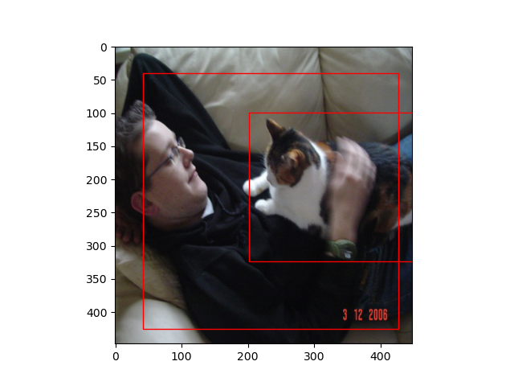
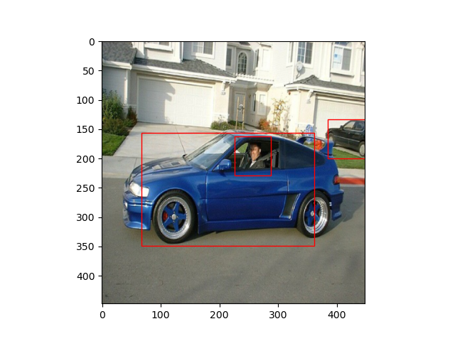

# YOLOv1

This is Object Detection model based on the [YOLOv1 architecture](https://arxiv.org/abs/1506.02640) written from scratch in **Pytorch**
The model is trained on [PascalVOC dataset](https://www.kaggle.com/datasets/aladdinpersson/pascalvoc-yolo)

# Usage examples
<table>
  <tr>
    <td></td>
    <td></td>
  </tr>
  <tr>
    <td></td>
    <td></td>
  </tr>
</table>